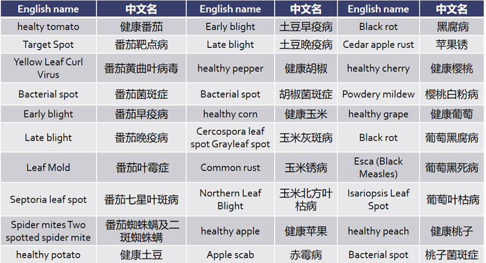
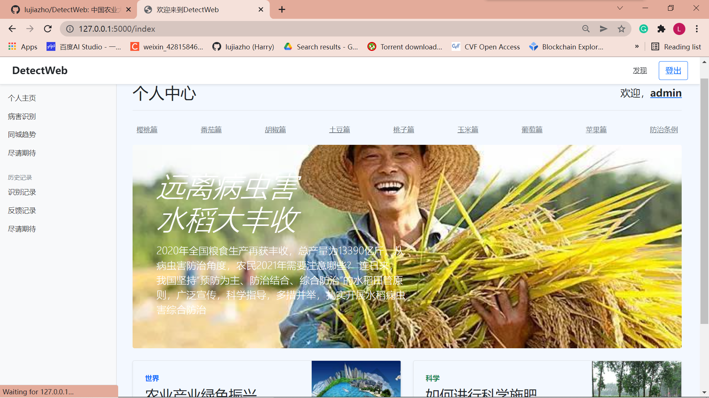
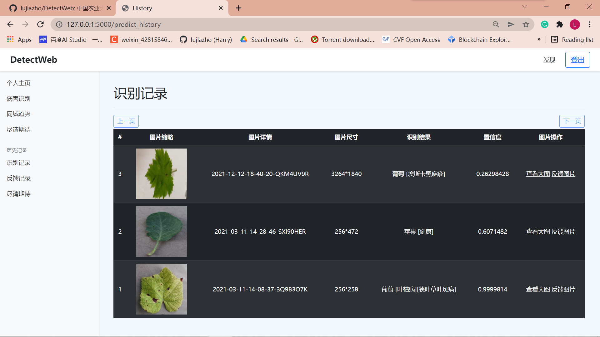
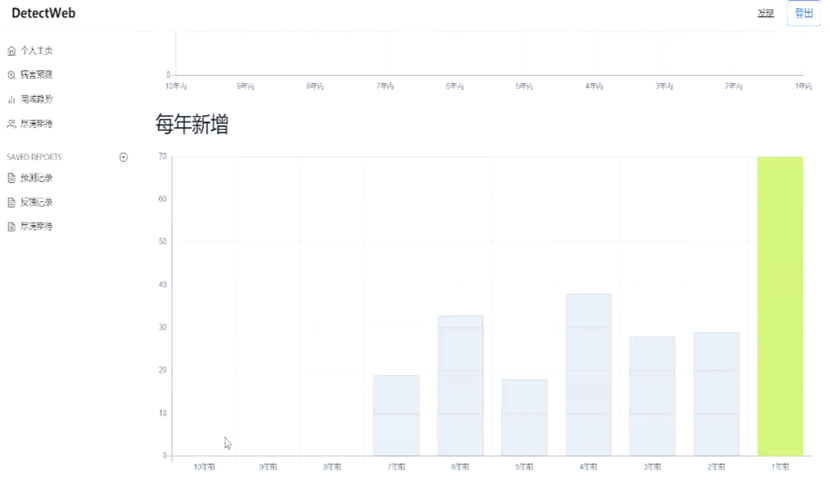

# DetectWeb
中国农业大学毕业实习项目：病虫害检测，类别有苹果、樱桃、玉米、葡萄、桃子、胡椒、土豆、番茄等

China Agricultural University Graduation Internship: the purpose is to recognize the health condition of a fruit based on image. The dataset contains 8 types of fruit and 31 types of corrsponding conditions.

```
Apple = ['[Apple_scab]', '[Black_rot]', '[Cedar_apple_rust]', '[healthy]']
Cherry = ['[Powdery_mildew]', '[healthy]']
Corn = ['[Cercospora_leaf_spot] [Gray_leaf_spot]', '[Common_rust]', '[Northern_Leaf_Blight]', '[healthy]']
Grape = ['[Black_rot]', '[Esca_Black_Measles]', '[Leaf_blight]', '[healthy]']
Peach = ['[Bacterial_spot]', '[healthy]']
Pepper = ['[Bacterial_spot]', '[healthy]']
Potato = ['[Early_blight]', '[Late_blight]', '[healthy]']
Tomato = ['[Target_Spot]', '[YellowLeaf_Curl_Virus]', '[Bacterial_spot]', '[Early_blight]', '[healthy]', '[Late_blight]', '[Leaf_Mold]', '[Septoria_leaf_spot]', '[Spider_mites]']
```

We train a general model for all types of fruit, which means this model can be used to examine all 8 fruit and corresponding conditions. 8 specialized models for a single fruit are also trained for better recognition accuracy.


## Software Environment
Project Framework：Flask + Bootstrap

Development Environment：Pycharm

Database：MySql

ORM library: SQLAlchemy

## Requirements
```
$ git clone https://github.com/lujiazho/DetectWeb.git
$ cd DetectWeb
$ pip install -r requirements.txt
```

## Demonstration
|Interface Ⅰ|Appearance|Interface Ⅱ|Appearance
|---|---|---|---
|<p align="center">Detection</p>||<p align="center">Main Interface</p>|
|<p align="center">Record</p>||<p align="center">Trend</p>|
